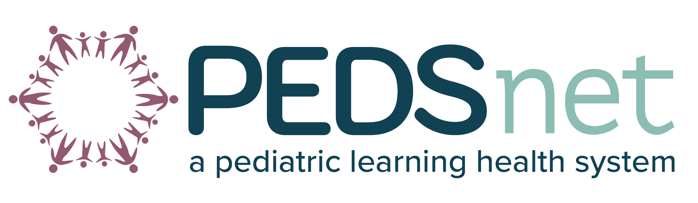

<!-- Improved compatibility of back to top link: See: https://github.com/othneildrew/Best-README-Template/pull/73 -->

<!--
*** Thanks for checking out the Best-README-Template. If you have a suggestion
*** that would make this better, please fork the repo and create a pull request
*** or simply open an issue with the tag "enhancement".
*** Don't forget to give the project a star!
*** Thanks again! Now go create something AMAZING! :D
-->

<!-- PROJECT SHIELDS -->
<!--
*** I'm using markdown "reference style" links for readability.
*** Reference links are enclosed in brackets [ ] instead of parentheses ( ).
*** See the bottom of this document for the declaration of the reference variables
*** for contributors-url, forks-url, etc. This is an optional, concise syntax you may use.
*** https://www.markdownguide.org/basic-syntax/#reference-style-links
-->
[![Contributors][contributors-shield]][contributors-url]
[![Issues][issues-shield]][issues-url]

<!-- PROJECT LOGO -->
 

  

<h3 align="center"><a href="https://pedsdspace01.research.chop.edu/home">PEDSpace</a></h3>

  

	PEDSpace is a robust implementation of the 	<a href="https://github.com/DSpace/DSpace" target="_blank">open-source DSpace software bundle</a>, designed to store and retrieve digital assets generated during PEDSnet studies. PEDSpace serves as a centralized hub where digital assets are made readily accessible to researchers, clinicians, and stakeholders worldwide.
  

  

     
    <a href="https://wiki.lyrasis.org/display/DSDOC8x/Introduction"><strong>Learn more about DSpace »</strong></a>
     
     
    <a href="https://pedsdspace01.research.chop.edu/home">View Demo*</a>
    ·
    <a href="https://github.com/PEDSnet/PEDSpace/issues/new?labels=bug&template=bug-report---.md">Report Bug</a>
    ·
    <a href="https://github.com/PEDSnet/PEDSpace/issues/new?labels=enhancement&template=feature-request---.md">Request Feature</a>
  

  
*PEDSpace is currently behind the CHOP firewall, meaning that you need a VPN connection to view. We eventually intend on making it publicly available.

<!-- TABLE OF CONTENTS -->

  
Table of Contents

  <ol>
    <li>
      <a href="#about-the-project">About The Project</a>
      <ul>
        <li><a href="#built-with">Built With</a></li>
      </ul>
    </li>
    <li><a href="#roadmap">Roadmap</a></li>
    <li><a href="#contributing">Contributing</a></li>
    <li><a href="#contact">Contact</a></li>
    <li><a href="#acknowledgments">Acknowledgments</a></li>
  </ol>

<!-- ABOUT THE PROJECT -->
## About The Project

[![Product Name Screen Shot][product-screenshot]](https://pedsdspace01.research.chop.edu/home)

PEDSpace is an open source repository application intended to host and serve PEDSnet-generated data on demand, as well as accept submissions from qualified users.

(<a href="#readme-top">back to top</a>)

### Built With

[![Java][Java]][Java-url]
[![Spring][Spring]][Spring-url]
[![PostgreSQL][PostgreSQL]][PostgreSQL-url]
[![Angular][Angular.io]][Angular-url]
[![Bootstrap][Bootstrap.com]][Bootstrap-url]
[![Apache Solr][Solr]][Solr-url]
[![Apache Tomcat][Tomcat]][Tomcat-url]

(<a href="#readme-top">back to top</a>)

<!-- ROADMAP -->
## Roadmap

### DSpace 8.0 Upgrade and Enhancements

- [x] Upgrade DSpace to version 8.0
- [x] Adapt and test custom theme for DSpace 8.0
- [x] Configure and initialize entity types and relationships
- [ ] Set up email functionality and SMTP server
- [ ] Implement deposit forms and workflow system
- [x] Resolve version information display issue
- [x] Implement default "item created" sort for search queries
- [ ] Develop process for handling non-character sequences in data
- [ ] Make PEDSpace site publicly accessible with proper security measures
- [ ] Update user guides and administrative documentation for DSpace 8.0

See the [open issues](https://github.com/PEDSnet/PEDSpace/issues) or the [project board](https://github.com/orgs/PEDSnet/projects/2) for a full list of proposed features (and known issues).

(<a href="#readme-top">back to top</a>)

<!-- CONTACT -->
## Contact

For technical queries:
- Arta Seyedian (seyediana1@chop.edu)
- Alex Shorrock (shorrocka@chop.edu)

For metadata or deposit-related queries:
- Annabel Pinkney (pinkneya1@chop.edu)

For questions about PEDSnet
- Morgan Botforf (botdorfm@chop.edu)

(<a href="#readme-top">back to top</a>)

<!-- ACKNOWLEDGMENTS -->
## Acknowledgments

* [DSpace Community](https://dspace.lyrasis.org/) - For developing and maintaining the DSpace software platform.
* [PEDSnet](https://www.pedsnet.org/) - For supporting the implementation of PEDSpace and contributing valuable resources.

(<a href="#readme-top">back to top</a>)

<!-- MARKDOWN LINKS & IMAGES -->
<!-- https://www.markdownguide.org/basic-syntax/#reference-style-links -->
[contributors-shield]: https://img.shields.io/github/contributors/PEDSnet/PEDSpace.svg?style=for-the-badge
[contributors-url]: https://github.com/PEDSnet/PEDSpace/graphs/contributors
[forks-shield]: https://img.shields.io/github/forks/PEDSnet/PEDSpace.svg?style=for-the-badge
[forks-url]: https://github.com/PEDSnet/PEDSpace/network/members
[stars-shield]: https://img.shields.io/github/stars/PEDSnet/PEDSpace.svg?style=for-the-badge
[stars-url]: https://github.com/PEDSnet/PEDSpace/stargazers
[issues-shield]: https://img.shields.io/github/issues/PEDSnet/PEDSpace.svg?style=for-the-badge
[issues-url]: https://github.com/PEDSnet/PEDSpace/issues
[license-shield]: https://img.shields.io/github/license/PEDSnet/PEDSpace.svg?style=for-the-badge
[license-url]: https://github.com/PEDSnet/PEDSpace/blob/master/LICENSE.txt
[linkedin-shield]: https://img.shields.io/badge/-LinkedIn-black.svg?style=for-the-badge&logo=linkedin&colorB=555
[linkedin-url]: https://linkedin.com/in/linkedin_username
[product-screenshot]: images/screenshot.png
[Java]: https://img.shields.io/badge/Java-ED8B00?style=for-the-badge&logo=java&logoColor=white
[Java-url]: https://www.oracle.com/java/
[Spring]: https://img.shields.io/badge/Spring-6DB33F?style=for-the-badge&logo=spring&logoColor=white
[Spring-url]: https://spring.io/
[PostgreSQL]: https://img.shields.io/badge/PostgreSQL-316192?style=for-the-badge&logo=postgresql&logoColor=white
[PostgreSQL-url]: https://www.postgresql.org/
[Angular.io]: https://img.shields.io/badge/Angular-DD0031?style=for-the-badge&logo=angular&logoColor=white
[Angular-url]: https://angular.io/
[Bootstrap.com]: https://img.shields.io/badge/Bootstrap-563D7C?style=for-the-badge&logo=bootstrap&logoColor=white
[Bootstrap-url]: https://getbootstrap.com/
[Solr]: https://img.shields.io/badge/Apache_Solr-D9411E?style=for-the-badge&logo=apache-solr&logoColor=white
[Solr-url]: https://solr.apache.org/
[Tomcat]: https://img.shields.io/badge/Apache_Tomcat-F8DC75?style=for-the-badge&logo=apache-tomcat&logoColor=black
[Tomcat-url]: https://tomcat.apache.org/

